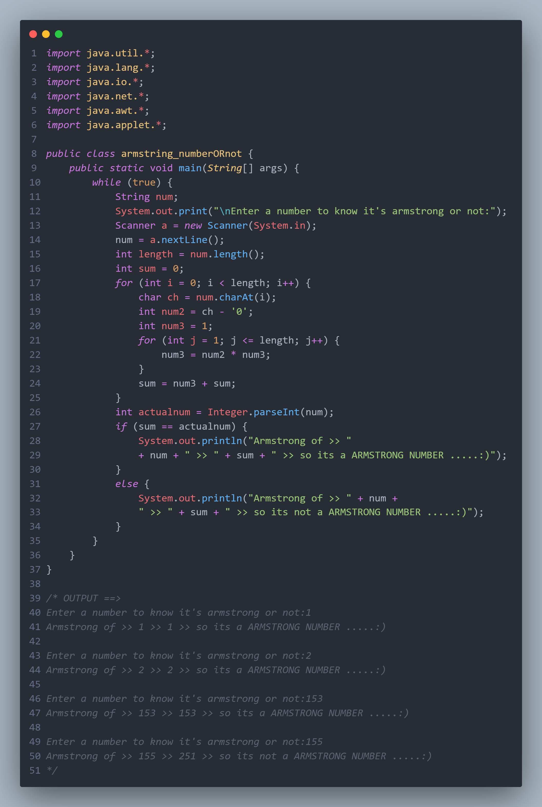

<h1 align="center">
   
  # Armstrong_number_JAVA 
 </h1>
<h2> Armstrong number or not in java without using in-built functions</h2>
  
<h2 align="center">
 🚀 #You can Download the 👆 FILE uploaded  (armstring_numberORnot.java) 🚀
 </h2>
